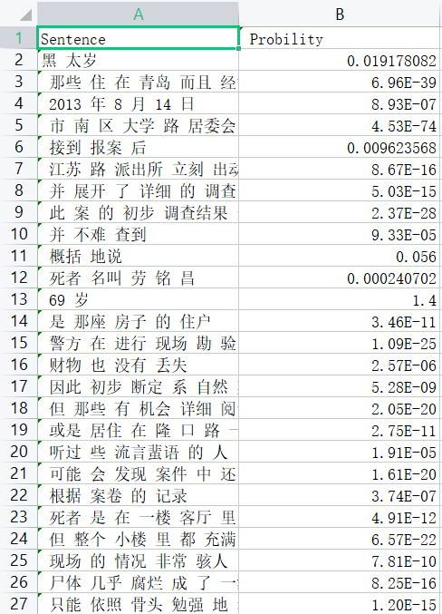

# **实验三 采用2元文法进行文本分词消歧**

## 摘要

## 目录

## 一、实验内容

针对实验二的分词结果，进行如下处理：

（1）正向、逆向最大匹配结果，对于歧义问题采用2元文法进行消歧。针对消歧后的文本，再次计算P、R、F1值。

（2）利用2元文法计算测试语料中每段话的概率。

## 二、实验原理

本次实验的实验原理是基于二元文法模型进行分词的思想。对于一个由m个基元(“基元”可以为字、词或短语等,为了表述方便,以后我们只用“词”来通指，每个基元用w表示)构成的句子s=，其概率计算公式可以表示为：

p(s) =p()p( | )p( | )...p( | )

这样计算概率这是理想模型，实际上实现这种模型并不现实，假如w1出现的概率是0.0001，w2出现的概率0.0001，一直累乘的话数字会成为一个天文数字。因此就引入了2元语法模型来解决这个问题。

可以看出，2元语法模型只和前面一个基元有关系，这样就简化了概率的数字范围，但是条件概率只是理想情况下可求，实际情况就用出现的频率来作为条件概率。

### 主要的问题

1. 对

## 整体框架

## 主要程序模块

1. 语料库提取模块
2. 二元语法xiao'qi

## 实验结果

### 1. 消歧前后准确率

|                |          | P      | R      | F      |
| -------------- | -------- | ------ | ------ | ------ |
| 优化前         | 正向匹配 | 0.7358 | 0.8515 | 0.7895 |
|                | 逆向匹配 | 0.7333 | 0.8486 | 0.7867 |
| 优化后         | 正向匹配 | 0.8529 | 0.9120 | 0.8815 |
|                | 逆向匹配 | 0.8451 | 0.9036 | 0.8733 |
| 二元语法消歧后 |          | 0.8498 | 0.9175 | 0.8824 |

### 2. 每段话的概率

## 实验总结

### 存在的问题

