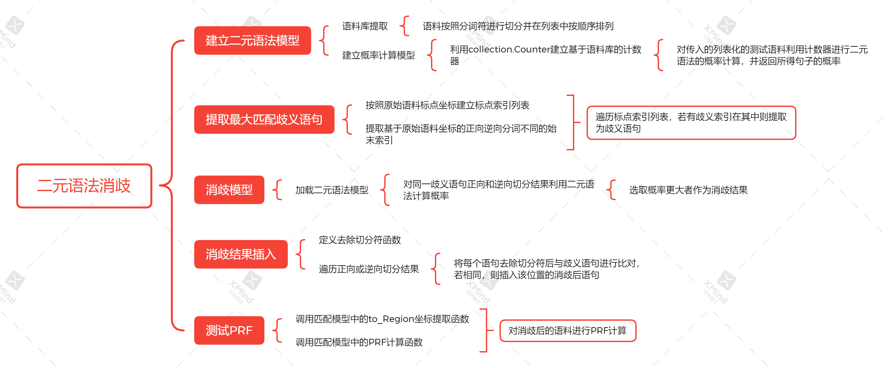

# **实验三 采用2元文法进行文本分词消歧**

## 摘要

## 目录

## 一、实验内容

针对实验二的分词结果，进行如下处理：

（1）正向、逆向最大匹配结果，对于歧义问题采用2元文法进行消歧。针对消歧后的文本，再次计算P、R、F1值。

（2）利用2元文法计算测试语料中每段话的概率。

## 二、实验原理

本次实验的实验原理是基于二元文法模型进行分词的思想。对于一个由m个基元(“基元”可以为字、词或短语等,为了表述方便,以后我们只用“词”来通指，每个基元用w表示)构成的句子.

这样计算概率这是理想模型，实际上实现这种模型并不现实，假如w1出现的概率是0.0001，w2出现的概率0.0001，一直累乘的话数字会成为一个天文数字。因此就引入了2元语法模型来解决这个问题。

可以看出，2元语法模型只和前面一个基元有关系，这样就简化了概率的数字范围，但是条件概率只是理想情况下可求，实际情况就用出现的频率来作为条件概率。

### 主要的问题

1. 对语料库的提取和二元语法模型的建立。
2. 对歧义句子的提取。

## 整体框架

## 主要程序模块

1. 语料库提取并建立二元语法模型模块
   从文件中获取训练语料后，消去标点、分词符、换行符后，将语料提取到列表中，作为提取频率的语料库。利用`collection.Counter`容器提取语料库为计数器格式。
   建立二元语法模型类`Two_Gram`，提取语料库中单个词词和相邻两个词的词，并建立相邻词的词频计数器`two_gram_words_count`作为属性。定义函数`get_Gram_count`从对应计数器中返回单个词或者相邻两词的词频。定义函数`two_gram_model`接受切分为列表的歧义句子，返回其语料库中的二元语法概率。利用线性插值法进行平滑`probility *= (lamba * pro + (1 - lamba) * one_word_count / len(yuliaoku))`。

2. 提取歧义部分模块
   调取匹配模型中的`to_Region`函数，用于根据分词结果提取在原始语料中的坐标，并提取正向分词和逆向分词坐标中不同的部分。并利用原始语料提取划分句子的标点和换行符坐标。并对标点坐标进行遍历，提取分词结果中歧义句子，并输出到文件。

3. 二元语法消歧模块
   调取匹配模型和二元语法模型，利用匹配模型中正向逆向最大匹配方法分别对歧义句子进行切分，并将切分结果提取到列表，对歧义句子的两种切分格式进行遍历，分别对两种切分方法调用二元语法模型进行概率计算，取其中较大者作为消歧结果，输出到文件中。

4. 插入消歧结果模块
   定义函数`getclean`获取去除切分符的句子，并对正向或逆向切分后的语料按句进行遍历，分别将`getclean`函数返回结果进行比对，若相同则用消歧结果进行替换。并将替换后切分语料输出到文件。

5. 测试优化后PRF模块
   提取消歧结果，调用匹配模型中的`to_Region`函数和`prf`函数进行PRF值的计算。

6. 计算每段话概率模块

## 实验结果

### 1. 消歧前后准确率

|                |          | P      | R      | F      |
| -------------- | -------- | ------ | ------ | ------ |
| 优化前         | 正向匹配 | 0.7358 | 0.8515 | 0.7895 |
|                | 逆向匹配 | 0.7333 | 0.8486 | 0.7867 |
| 优化后         | 正向匹配 | 0.8529 | 0.9120 | 0.8815 |
|                | 逆向匹配 | 0.8451 | 0.9036 | 0.8733 |
| 二元语法消歧后 |          | 0.8498 | 0.9175 | 0.8824 |

### 2. 每段话的概率

## 实验总结

### 存在的问题

